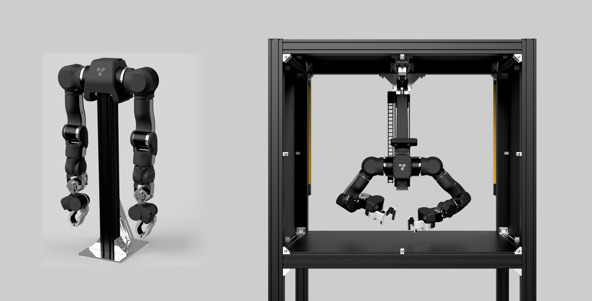

# OpenArm

**OpenArm** is an open-source 7DOF humanoid arm designed for physical AI research and deployment in contact-rich environments. With high backdrivability and compliance, it is built with safe human-robot interaction in mind while delivering practical payload capabilities for real-world applications.

**OpenArm Cell** (on the right) is a standardized environment with unified background, lighting, and camera placement. Research performed using OpenArm can be reproduced around the world in consistent evaluation conditions, facilitating the global discussion on state of the art physical AI research.

OpenArm features **human-scale** proportions, safety and compliance, and practical payloads. At $6,500 USD for a complete bimanual system, it provides a flexible platform for teleoperation, imitation learning, simulation, and real-world data collection in contact-rich tasks.

*We're in continuous development and actively seeking contributors, research partners, and company collaborators to shape the next generation of practical humanoid systems. Ready to join the future of open-source robotics?*

> ### 📦 Purchase Your OpenArm!
> Get your **OpenArm**, assembled or DIY, and join the global community!  
> Browse verified and certified manufacturers worldwide. 
> 
> [**Buy Now →**](https://docs.openarm.dev/purchase)

## 🔗 Quick Links

| Platform | Description | Link |
|----------|-------------|------|
| **Website** | Project homepage and media | [openarm.dev](https://openarm.dev) |
| **Documentation** | Complete technical guides | [docs.openarm.dev](https://docs.openarm.dev) |
| **Discord** | Community discussions | [Join Discord](https://discord.gg/FsZaZ4z3We) |
| **Contact** | Direct communication | [openarm@enactic.ai](mailto:openarm@enactic.ai) |

## 📁 Repositories

| Repository | Documentation | License | Description |
|------------|---------------|---------|-------------|
| **[openarm_hardware](https://github.com/enactic/openarm_hardware)** | [Hardware Docs](https://docs.openarm.dev/hardware) | [CERN-OHL-S-2.0](https://github.com/enactic/openarm_hardware/blob/main/LICENSE.txt) | Complete CAD data: STL files, STEP files, Fusion 360 assemblies |
| **[openarm_description](https://github.com/enactic/openarm_description)** | [Description Docs](https://docs.openarm.dev/api-reference/description/) | [Apache-2.0](https://github.com/enactic/openarm_description/blob/main/LICENSE.txt) | Robot description files with URDF/xacro for simulation |
| **[openarm_can](https://github.com/enactic/openarm_can)** | [CAN Docs](https://docs.openarm.dev/api-reference/can/) | [Apache-2.0](https://github.com/enactic/openarm_can/blob/main/LICENSE.txt) | CAN control library for low-level motor communication |
| **[openarm_ros2](https://github.com/enactic/openarm_ros2)** | [ROS2 Docs](https://docs.openarm.dev/api-reference/ros2/install) | [Apache-2.0](https://github.com/enactic/openarm_ros2/blob/main/LICENSE) | ROS2 integration packages and nodes |
| **[openarm_teleop](https://github.com/enactic/openarm_teleop)** | [Teleop Docs](https://docs.openarm.dev/teleop/) | [Apache-2.0](https://github.com/enactic/openarm_teleop/blob/main/LICENSE.txt) | Teleoperation packages with unilateral and bilateral control |
| **[openarm_isaac_lab](https://github.com/enactic/openarm_isaac_lab)** | [Isaac Docs](https://docs.openarm.dev/simulation/) | [Apache-2.0](https://github.com/enactic/openarm_isaac_lab/blob/main/LICENSE.txt) | Isaac Lab simulation environment and training tasks |
| **[openarm_mujoco](https://github.com/enactic/openarm_mujoco)** | [MuJoCo Docs](https://docs.openarm.dev/simulation/mujoco) | [Apache-2.0](https://github.com/enactic/openarm_mujoco/blob/master/LICENSE) | MuJoCo specification files and assets for OpenArm |
| **[openarm_dataset](https://github.com/enactic/openarm_dataset)** | [Dataset Docs](https://docs.openarm.dev/dataset/) | [Apache-2.0](https://github.com/enactic/openarm_dataset/blob/main/LICENSE.txt) | Dataset format, recording tools, and Python API |
| **[dora-openarm](https://github.com/enactic/dora-openarm)** | [Dora Docs](https://docs.openarm.dev/api-reference/dora/) | [Apache-2.0](https://github.com/enactic/dora-openarm/blob/main/LICENSE) | Dora dataflow nodes for data collection, inference, and teleop |

## 📄 Code of Conduct

All participation in the OpenArm project is governed by our [Code of Conduct](CODE_OF_CONDUCT.md).
